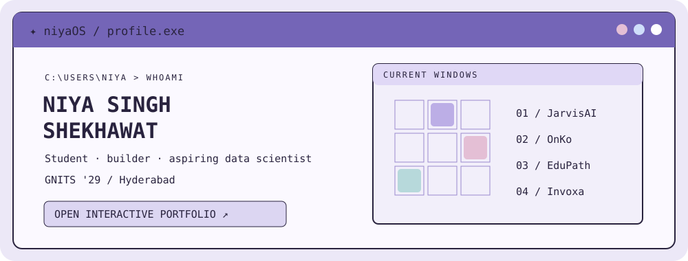

  

  <h1>Niya Singh Shekhawat</h1>
  
<strong>Tech enthusiast · Aspiring data scientist · CSE (Data Science), GNITS ’29</strong>

  
Building things, exercising free will, and figuring out how they work along the way.

  <a href="https://niyasinghshekhawat.github.io/NiyaSinghShekhawat/">Enter the interactive portfolio ↗</a> ·
  <a href="https://www.linkedin.com/in/niya-singh-shekhawat-123548307/">LinkedIn</a> ·
  <a href="https://github.com/NiyaSinghShekhawat?tab=repositories">All repositories</a>

---

### Open windows

| Window | What’s inside | Source |
| :--- | :--- | :--- |
| **JarvisAI** | A desktop voice assistant with tools and local model fallback | [Open ↗](https://github.com/NiyaSinghShekhawat/JarvisAI) |
| **OnKo** | Cancer care coordination and patient engagement, built with team 404 Found | [Open ↗](https://github.com/NiyaSinghShekhawat/OnKo_Prismtech) |
| **EduPath** | A learning platform exploring personalized practice and progress | [Open ↗](https://github.com/NiyaSinghShekhawat/EduPath) |
| **Invoxa** | Desktop billing and GST workflows | [Open ↗](https://github.com/NiyaSinghShekhawat/Invoxa-smart_billing) |

The real cursor-reactive portrait and draggable windows live in the portfolio. GitHub renders this README without JavaScript.

### Run the portfolio

This repository also contains the portfolio website. It uses plain HTML, CSS, and JavaScript, with no install step. Open `index.html` locally, or serve this directory with `python -m http.server 8000`.

To publish through GitHub Pages: **Settings → Pages → Deploy from a branch → main → /(root)**. The link above will work after Pages is enabled. Replace `assets/portrait.jpg` with your own photo to personalize the portrait; the GitHub avatar is used until then.
